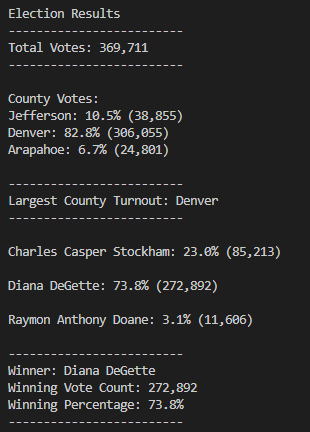

# Election Analysis with Python

## Overview of Election Audit

### Purpose

### Project Overview
A Colorado Board of Elections employee has given you the following tasks to complete the election audit of a recent local congressional election.

1. Calculate the total number of votes cast.
2. Get a complete list of candidates who received votes.
3. Calculate the total number of votes each candidate received.
4. Calculate the percentage of votes each candidate won.
5. Determine the winner of the election based on popular vote.

### Resources
- Data Source: election_results.csv
- Software: Python 3.7.6, Visual Studio Code. 1.71.0

## Election Audit Results 
  - In total, 369,711 votes were cast in this congressional election.
  - County Results:
    - Jefferson county received 38,855 votes which made up 10.5% of the total votes. 
    - Denver county received 306,055 votes for 82.8% of the total. 
    - Arapahoe county received 24,801 votes for 6.7% of the total. 
  - Therefore, Denver county had the largest number of votes. 
  - Candidate Results:
    - Charles Casper Stockham received 85,213 votes which made up 23.0% of the total votes. 
    - Diana DeGette received 272,892 votes for 73.8% of the total. 
    - Raymon Anthony Doane received 11,606 votes for 3.1% of the total. 
  - Therefore, Diana DeGette won the election with 272,892 votes and 73.8% of the total. 
  

## Election Audit Summary
This script can be used for any election in which the winner is chosen by plurality (getting more votes than everyone else) rather than majority (winning more than half the votes). If we wanted to use this script for the Presidental election, we would first need to change all the county variables, lists, and dictionaries to be for states. This is assuming the data contained the Ballot ID, State, and Candidate. So we would have state_options, state_votes, largest_state, largest_state_votes, state_vote, state_percentage, and state_results. This would also include changes to the command line print statements and the write statements to our election_results.txt file. The part of the code in which we determine which state had the largest voter turnout could remain the same, as we only need the one that has more than any other. For the part of the code where we determine which candidate won, we would loop through all the candidates and if one has greater than 50% of the vote (or technically greater than or equal to 270 electoral college votes), then they are saved as the winning candidate.

